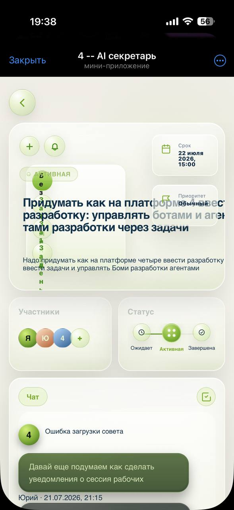
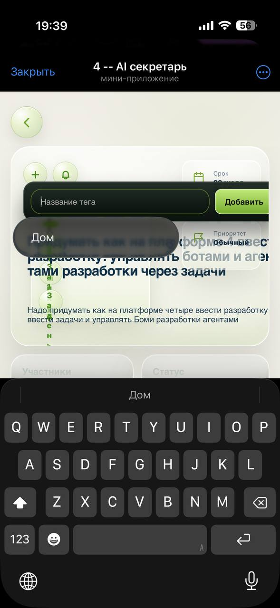

# Task detail iOS/TMA regression audit - 2026-07-22

## Scope

- Surface: task detail in Telegram Mini App on iPhone.
- User goal: set a reminder time and read/edit task metadata without overlays hiding content.
- Source build: current QA preview `b7076e2`.

## Evidence

### Step 1 - task detail before opening tag editor - broken

- A long tag is squeezed into a narrow column and wraps one letter per line.
- The task title overlaps the right-side deadline/priority cards.
- Description/title content is clipped inside the fixed-height hero.
- Reminder timing could not be opened, blocking notification delivery QA.

### Step 2 - tag editor with iOS keyboard - blocked

- The tag input is positioned over the task hero instead of taking space in normal flow.
- The native `datalist` suggestion (`Дом`) covers the title and metadata.
- The keyboard leaves no usable view of the edited content and there is no visible close/cancel action.

## Source findings

1. `index.html:462` nests a hidden `<select>` inside the reminder `<button>` and also wires a custom click popover. Nested interactive controls are invalid/fragile on mobile WebViews.
2. `styles/screens/tasks.less:2561` reduces the reminder and tag buttons to `36x36`, below the project's established 44px mobile target.
3. `index.html:464` uses native `<datalist>` for tag suggestions. iOS/TMA renders that suggestion UI outside the app's layout control.
4. `styles/screens/tasks.less:1449` absolutely positions the tag editor at `top:58px` with overlay z-index; `toggleTagInput()` at `index.html:5829` only toggles display/focus and does not provide outside-tap/cancel handling.
5. `styles/screens/tasks.less:2481` and later QA patches absolutely position the title at `top:172px`, description at `top:260px`, clamp both, and keep a fixed-height hero. This conflicts with the absolute right metadata stack and produces the overlap seen on iPhone.

## Bugs

- `BUG-2026-07-22-001`: reminder timing control cannot be tapped in iOS TMA.
- `BUG-2026-07-22-002`: tag editor/native suggestion popup covers task content and has poor keyboard behavior.
- `BUG-2026-07-22-003`: long tag/title and right metadata overlap or clip in the task hero.

## Recommended fix order

1. Make reminder markup a standalone 44x44 button plus sibling popover; remove the nested select and verify pointer events on iOS TMA.
2. Replace native tag `datalist` with an app-owned suggestion list and add explicit cancel/outside-tap dismissal; keep the editor above the keyboard without covering the hero.
3. Replace the accumulated absolute hero placement with one responsive grid/flow. Keep title and description in normal flow, move metadata below or into a non-overlapping column, ellipsize long tags, and avoid letter-by-letter wrapping.
4. Add a 390x844 regression smoke with a long Russian title/tag, open tag editor, open reminder picker, keyboard state, and screenshot/overlap assertions; finish with a real iPhone TMA check.

## Evidence limits

- Screenshots confirm visual overlap and the user's failed tap, but cannot identify the exact event target receiving the touch.
- Sound, vibration, background delivery, and correct-recipient notification behavior remain untested because the reminder could not be configured.
